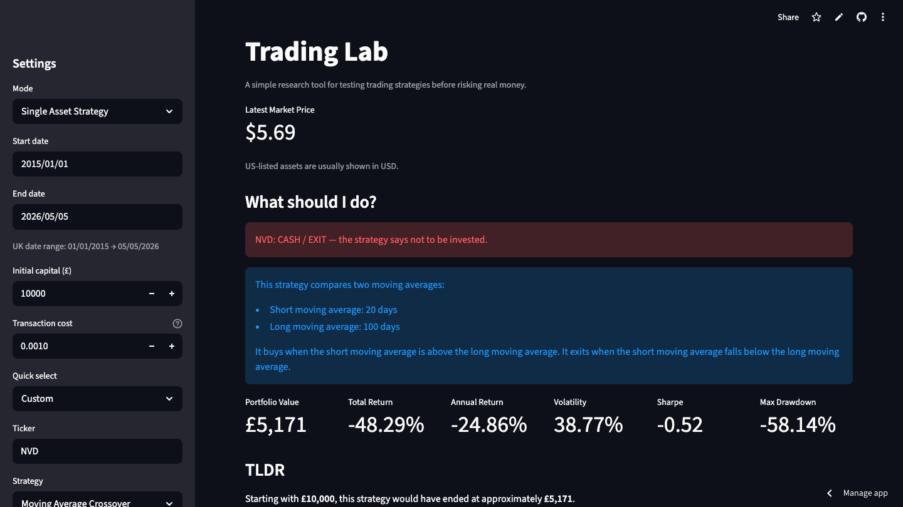
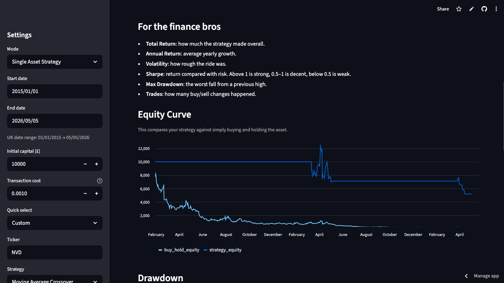
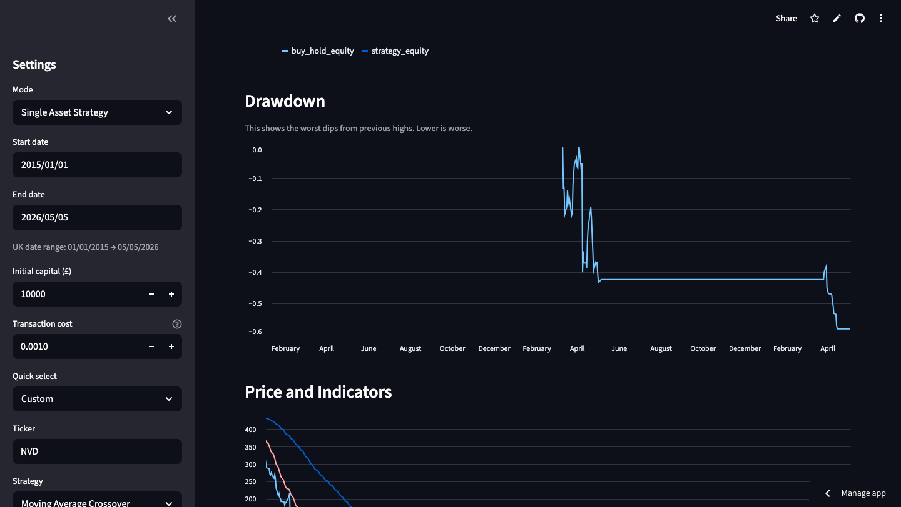
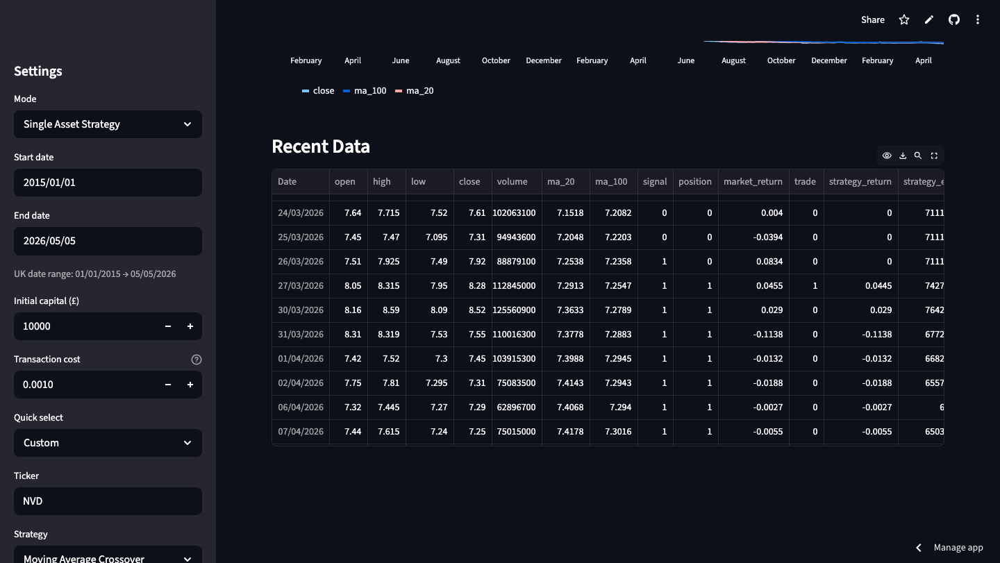

# Trading Lab

> “Because most retail investors are flying blind. You? You don’t have to.”

Trading Lab is your personal research sandbox for **systematic trading strategies**, backtested against historical data, with signals that tell you when to be in the market and when to stay on the sidelines.

If you want to play like the professionals — without actually paying for a hedge fund license — this is your playground.

This is **not magic**. This is **math, finance, and Python**, working together so you can make smarter decisions than your mate who thinks trading is “buy low, sell high.”

---

## Screenshots






## Features

### Single-asset strategies
- Moving Average Crossover (classic trend-following)
- RSI Mean Reversion (buy weakness, sell strength)

### Multi-asset momentum ranking
- Compare SPY, QQQ, BTC-USD, GLD, FTSE 100, and more
- Find the top-ranked asset based on recent momentum
- Get a clear, blunt **“Invest / Stay Cash”** decision

### Risk & performance metrics
- Portfolio value evolution
- Total and annualised returns
- Volatility and Sharpe ratio (risk-adjusted IQ points)
- Max drawdown (what would have made you cry)

### UK / US / Crypto support
- Prices shown correctly for GBX, USD, and crypto
- UK-friendly date formatting (DD/MM/YYYY)

### Live-ish pricing
- Not exactly Bloomberg-terminal live, but good enough for checking current levels

### Visualisations
- Equity curves vs buy-and-hold baseline
- Drawdowns
- Price + indicator overlays
- Momentum ranking charts

---

## How it works

1. Pick your asset universe (single or multiple)  
2. Choose a strategy (or rely on momentum ranking)  
3. Let the system generate a signal:  
   - **BUY / HOLD → be invested**  
   - **CASH / EXIT → stay out**  
4. Review metrics (returns, volatility, drawdown)  
5. Make a decision based on data, not vibes  

> Pro tip: This is for research and education. Don’t blame the code if you end up in a red chart. It only simulates past performance — the future is still chaos.

---

## Quick Start

```bash
git clone https://github.com/calltekk/tradinglab.git
cd tradinglab
python3 -m venv .venv
source .venv/bin/activate
pip install -r requirements.txt
streamlit run app.py
